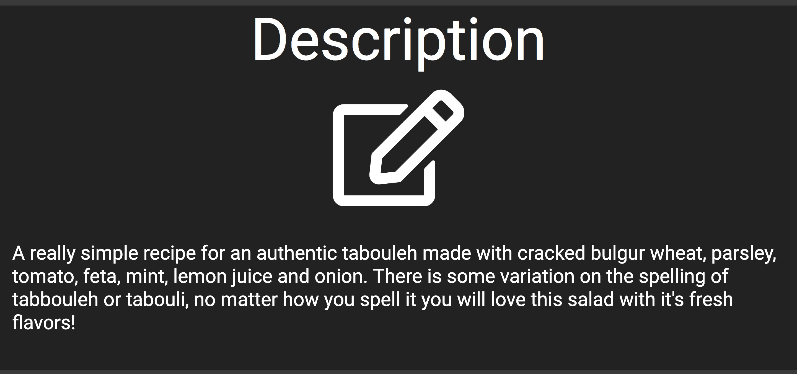
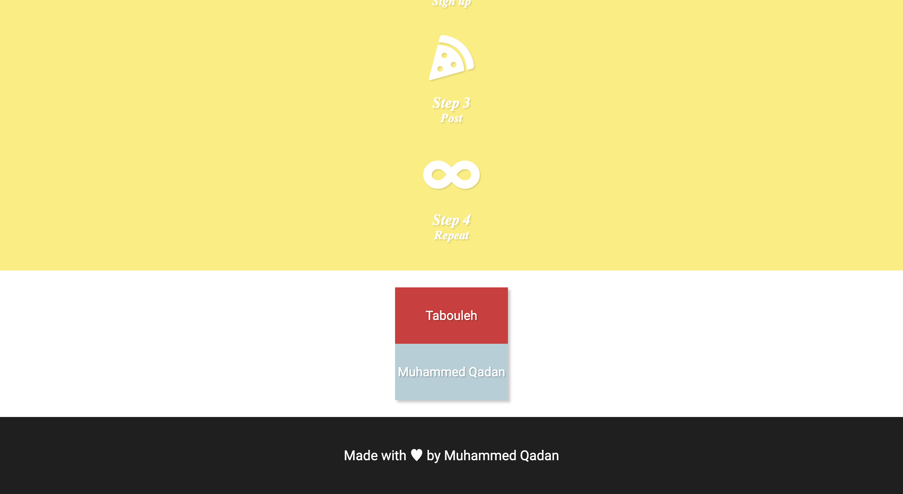

# :pizza::poultry_leg::hamburger: Farawla :doughnut::curry::fries:

## Farawla, the Arabic word for Strawberry.

##### This Web Application is a simplistic approach to a recipe websites. Straight to the point to the stuff that matters. 

## :cookie: Home Page

## :cookie: Getting started is super easy:

## :cookie: Recipe Page

## :cookie: Description of a recipe (See, super simple)

## :cookie: Recipes

## :cookie: Users may comment

## :cookie: Deleting and Editing is super easy too!

# :pizza::poultry_leg::hamburger: Farawla :doughnut::curry::fries:

